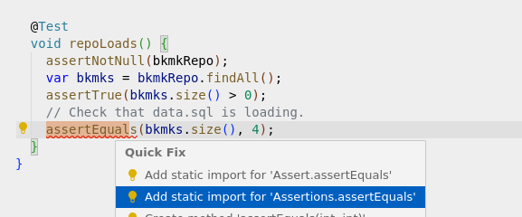

# Integration Testing with Spring Boot 3.2
_Integration Tests_, provides a way of insuring that the application functions with 
rest endpoints, and database without mocking, catching unexpected behaviors. 
Where does one begin to actually test the application? If this is the question then this is the 
right place. In this guide the complexities will be simplified. 

The guide in particular will be looking at using TestContainers to do the integration tests. 
The advantages of using a TestContainer is that there is no need to stand up database to test; 
this is what the testcontainers perform. The integration tests spins up docker container(s) and 
can even populate database in the same function as in development with a schema and data from 
files that one is likely using in development such as the schema.sql  & data.sql in /src/main/
resources.

<br/>

_**This guide is intended to be read in the form of a DO-CONFIRM Checklist.
DO/ACK each step, CONFIRM the results/ideas.**_

----
# Checklist: 
- [ ] [General Advice](#general-advice) 
- [ ] [Setup](#setup)
	- [ ] [Annotations](#annotations)
	- [ ] [build.gradle for testing ](#buildgradle-for-testing)
- [ ] [TestContainers](#testcontainers)
---

<br>
<br>

# General Advice 
Writing tests is not something most engineers enjoy doing, and its even more frustrating when at every step one finds themselves stumbling. Here is my general advice for JUnit5 with Spring Boot:
- [ ] [Imports](#imports)
- [ ] [Spring Boot Docs](#spring-boot-docs)
- [ ] [Follow Experts](#follow-experts)
---

## Imports

``` java
// import only junit.jupiter
import static org.junit.jupiter.*;
```

### PAUSE POINT:

JUnit has been around for a very long time and it's way too easy with VSCode to import the old packages. 

``` java
// JUnit5 - juipiter
import static org.junit.jupiter.api.Assertions.assertEquals;
// JUnit4 
import static org.junit.Assert.assertEquals;
```

#### _Example_:


---

<br>


## Spring Boot Docs
Visit: 
- [Spring 3.2 Docs](https://docs.spring.io/spring-boot/docs/3.2.0-M2/reference/html/features.html#features.testing)
- [EnabledIf](https://docs.spring.io/spring-framework/reference/testing/annotations/integration-junit-jupiter.html) - Used for enabling tests only on a given profile.

### PAUSE POINT: 

The Spring API docs are confusing but they at least let one know where to begin searching. Recommend one always to search for `Spring Boot <Version> release docs` and these are 
usually the are much better than the general Spring Framework page. 

With that said it is important to know where to begin, for example right when one has checked everything to do with JUnit is Jupiter... It was really a Spring Jupiter annotation that was needed in the case of [EnabledIf](https://docs.spring.io/spring-framework/reference/testing/annotations/integration-junit-jupiter.html)

---

## Follow Experts 
Follow: [Dan Vegas Github](https://github.com/danvega)
### Video reference: 
[Integration Testing with Dan Vegas Spring 3.2](https://www.youtube.com/watch?v=erp-7MCK5BU)

### PAUSE POINT:

- Dan Vegas: Spring Developer Advocate at VMWare and his YouTube videos are phenomenal, it will save hours of configuring things that are handled in latter versions of Spring 
- [Back to checklist](#checklist)

<br>

# Setup
## Annotations
DO:
- Create an annotation directory in `/src/main/test/java/<package_paths>/annotations`
	- This code's test path is: `src/test/java/dev/findfirst/core/annotations/`
- Create `/src/test/java/<package_paths>/annotations/IntegrationTestConfig.java`
   IntegrationTestConfig.java
``` java
// DO: ADD com.your.project;
import java.lang.annotation.ElementType;
import java.lang.annotation.Retention;
import java.lang.annotation.RetentionPolicy;
import java.lang.annotation.Target;
import org.springframework.test.context.junit.jupiter.EnabledIf;

@Target(ElementType.TYPE)
@Retention(RetentionPolicy.RUNTIME)
@EnabledIf(expression = "#{environment['spring.profiles.active'].contains('integration')}")
public @interface IntegrationTest {}
```

### PAUSE POINT: 

One thing that makes testing easier is being able to only run these integration tests when required. 
This annotation does exactly that. To enable classes that have the `@IntegrationTestConfig` at the top set the Spring Profile to integration. 

- [Back to checklist](#checklist)

---

## build.gradle for testing 
Note the [jacoco plugin](https://docs.gradle.org/current/userguide/jacoco_plugin.html) is used for creating code coverage
``` java
test {
	systemProperty 'spring.profiles.active', 'dev'
	useJUnitPlatform()
	testLogging.showStandardStreams = true
	finalizedBy jacocoTestReport // report is always generated after tests run
}
```
- [Back to checklist](#checklist)

<br>

# TestContainers
## Add dependencies
Gradle: 

```groovy
dependencies {
	// ... Other dependencies.
  testImplementation 'org.testcontainers:junit-jupiter'
  testImplementation 'org.testcontainers:postgresql'
  testImplementation 'org.testcontainers:postgresql'
	testImplementation 'org.springframework.boot:spring-boot-testcontainers'
	testImplementation "org.testcontainers:junit-jupiter:1.19.3"
}
```

### PAUSE POINT: 

- CONFIRM: IDE has rebuilt.

## TestContainers In Action

``` java
package dev.findfirst.core;

import static org.assertj.core.api.AssertionsForClassTypes.assertThat;
import static org.junit.jupiter.api.Assertions.assertEquals;
import static org.junit.jupiter.api.Assertions.assertNotNull;
import static org.junit.jupiter.api.Assertions.assertTrue;

import dev.findfirst.core.annotations.IntegrationTestConfig;
import dev.findfirst.core.repository.BookmarkRepository;
import dev.findfirst.security.userAuth.tenant.contexts.TenantContext;
import org.junit.jupiter.api.Test;
import org.springframework.beans.factory.annotation.Autowired;
import org.springframework.boot.test.autoconfigure.jdbc.AutoConfigureTestDatabase;
import org.springframework.boot.test.autoconfigure.orm.jpa.DataJpaTest;
import org.springframework.boot.test.mock.mockito.MockBean;
import org.springframework.boot.testcontainers.service.connection.ServiceConnection;
import org.testcontainers.containers.PostgreSQLContainer;
import org.testcontainers.junit.jupiter.Container;
import org.testcontainers.junit.jupiter.Testcontainers;

@Testcontainers
@DataJpaTest
@AutoConfigureTestDatabase(replace = AutoConfigureTestDatabase.Replace.NONE)
@IntegrationTest
public class DatabaseTest {

  @Container @ServiceConnection
  private static final PostgreSQLContainer<?> postgres = new PostgreSQLContainer<>("postgres:15.4");

  @Autowired BookmarkRepository bkmkRepo;

  @Test
  void connectionEstablish() {
    assertThat(postgres.isCreated()).isTrue();
  }

  @Test
  void repoLoads() {
    assertNotNull(bkmkRepo);
    var bkmks = bkmkRepo.findAll();
    assertTrue(bkmks.size() > 0);
    // Check that data.sql is loading.
    assertEquals(bkmks.size(), 4);
  }
```

- DO: 
	- Copy DatabaseTest.java *the above code to desired location*
	- Add  Repository 
	  `@Autowired RepoName repoName`
	- Run Test: `./gradlew test`
- CONFIRM: 
	- TestContainers did not run.
	- _**ELSE**:_ check imports, configuration, etc. TestContainer should not run with Annotation.
- DO:  
	- Change: build.gradle `systemProperty 'spring.profiles.active', 'dev'` to `	systemProperty 'spring.profiles.active', 'integration'`
- CONFIRM: 
	- Tests Run.
	- TestContainers started without errors.


### PAUSE POINT: 

TestContainers support many databses, in this example PostgreSQL is being used. Refer to docs for other databases: [TestContainers](https://testcontainers.com/guides/testing-spring-boot-rest-api-using-testcontainers/) 

The database test was a way to ensure that the database container was working and data was 
being seeded by the SQL scripts. In the next section writing real controller tests will be covered. 

Annotation Summary.
- `@Testcontainers`: Spins up and down the container for test. 
- `@DataJpaTest`: Specifies we only want to bring up the DataJpaBeans (database classes).
	- This is why MockBean is used as some security contexts are still reference by the repository. 
- `@AutoConfigureTestDatabase(replace = AutoConfigureTestDatabase.Replace.NONE)`: Don't use the default settings, let the @ServiceConnection handle the configuration.
- `@ServiceConnection`: Establishes the connection parameters to the database container for the user.
- `@Container`: Specifies container should be managed by Testcontainers.
- `@Autowired`: Inject a real bean. 
- `@Test`: JUnit5 Test.

NOTE: VSCode Testing extension requires a profile to be added: to settings.json 
``` json
    "java.test.config": [
        {
            "name": "projectname",
            "workingDirectory": "${workspaceFolder}",
            "mainClass": "dev.findfirst.FindFirstApplication",
            "vmArgs": ["-Dspring.profiles.active=integration"],
        },
    ]
```

- [Back to checklist](#checklist)

## Writing Real Tests

``` java
@Testcontainers
@IntegrationTest
@SpringBootTest(webEnvironment = SpringBootTest.WebEnvironment.RANDOM_PORT)
public class BookmarkControllerTest {

  @Container @ServiceConnection
  static PostgreSQLContainer<?> postgres = new PostgreSQLContainer<>("postgres:15-alpine");

  @Autowired BookmarkRepository bkmkRepo;

  @Autowired TestRestTemplate restTemplate;

  @Test
  void addBookmark() {
    var ent = getHttpEntity(restTemplate, new AddBkmkReq("My Favorite Chicken Parm", "https://cafedelites.com/crispy-chicken-parmesan/", List.of()));
    var response = restTemplate.exchange("/api/bookmark", HttpMethod.POST, ent, Bookmark.class);
    assertEquals(HttpStatus.OK, response.getStatusCode());
    var bkmk = Optional.ofNullable(response.getBody());
    assertEquals("Facebook", bkmk.orElseThrow().getTitle());
  }

```

### PAUSE POINT: 

- `restTemplate.exchange` - executes requests. 
	- Param 1: URL
	- Param 2: Body/Header 
	- Param 3: Method
	- Param 4: Expected return type in the ResponseEntity. 
- getHttpEntity - Custom function to attach the jwt that is required to access end point: 
``` java
  public static <T> HttpEntity<?> getHttpEntity(TestRestTemplate restTemplate, T body) {
    HttpHeaders headers = new HttpHeaders();
    // test user
    headers.setBasicAuth("jsmith", "test");
    HttpEntity<String> entity = new HttpEntity<>(headers);
    var signResp = restTemplate.postForEntity("/user/signin", entity, TokenRefreshResponse.class);

    // Get the cookie from signin.
    var cookieOpt = Optional.ofNullable(signResp.getHeaders().get("Set-Cookie"));
    var cookie = cookieOpt.orElseThrow();

    // Add the cookie to next request.
    headers = new HttpHeaders();
    headers.add("Cookie", cookie.get(0));
    return new HttpEntity<>(body, headers);
  }
```  
- Explore the other restTemplateOptions: 
	- `getForObject`  
	- `getForEntity`  

#### Final Note on `@Transactional`
Note that in Integration test a complete web server/client is started and thus the tests are not running on the same thread as the server and that prevents `@Rollback` to work as it would ordinarily. 

- [Back to checklist](#checklist)